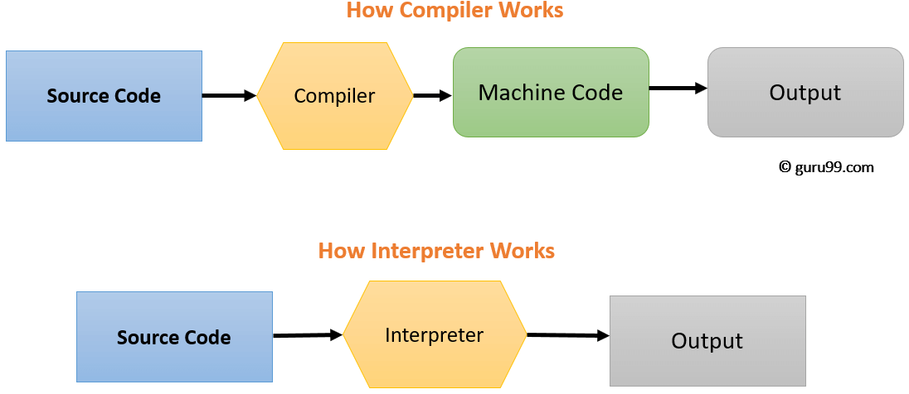

# Node.JS와 개발환경

## 프로그래밍 언어와 JavaScript

 

###  ♢ Compiled와 interpretered의 차이점은?
  Compiler와 Interpreter 둘 다 C언어나 Java같은 고레벨언어로 작성된 프로그래밍 언어를 기계어로 변환하는 것은 맞지만 그 과정에 있어서 차이를 보인다.  

  
   

- <b>Compile</b> :  원시코드(프로그래머가 작성한 소스코드)를 런타임 이전에 기계어로 해석하는 작업 방식. 이 때 원시코드를 목적 코드(Object Code)로 바꿔준다.  
런타임 이전에 Assembly 언어로 변환하기 때문에 구동 시간이 오래걸리지만, 구동된 이후는 하나의 패키지로 매우 빠르게 작동하게 된다. 구동시에 코드와 함께 시스템으로부터 메모리를 할당받으며 할당받은 메모리를 사용하게 된다.  
런타임 이전에 이미 해석을 마치고 대게 컴파일 결과물이 바로 기계어로 전환되기 때문에 OS 및 빌드 환경에 종속적이다. 그러므로 OS환경에 맞게 호환되는 라이브러리와 빌드환경을 구분해서 구축해줘야 한다.  
Compile 언어로 C/C++을 들 수 있으며, Java 역시 컴파일러가 Java파일을 컴파일해서 Byte Code를 만든다(그리고 Byte Code를 런타임에서 인터프리터가 해석한다).

- <b>Interpret</b> :  
원시코드(프로그래머가 작성한 소스코드)를 기계어로 변환하는 과정없이 한줄 한줄 해석하여 바로 명령어를 실행하는 방식.  
프로그래밍 언어를 기계어로 바로 바꾸지 않고, 중간 단계를 거친 뒤, 런타임에서 즉시 해석하기 때문에 컴팩트한 패키지 형태로 Binary파일을 뽑아낼 수 있는 Compile 방식에 비해 낮은 퍼포먼스를 보인다. a 
런타임에 직접 코드를 구동시키는 특징이 있기 때문에 실제 실행시간은 느리며, 대신 런타임에 실시간 Debugging 및 코드 수정이 가능하다. 또한 메모리를 별도로 할당받아 수행되지 않으며, 필요할 때 할당하여 사용한다.  
대표적인 Interpreter언어로는 JavaScript와 같은 스크립팅 언어들이 있다. 하지만 이뿐만 아니라 컴파일 이후의 동작에서 Interpret을 수행하는 언어들도 많이 존재한다. 
많은 언어들이 해석을 위한 Virtual Machine을 두고, Machine위해서 Interpret을 수행하게 되는데, 이 때 해석의 기반이 되는 머신들이 OS환경들을 지원해줌으로써 OS 및 플랫폼에 종속되지 않는 프로그램 구동이 가능하다(이런 inpterpreter에는 Java의 JVM과 Python의 Analyzer가 있다 - 둘 다 Byte Code를 사용하기 때문에 Virtual Machine이 필요하다).

 

### ♢ 다양한 프로그래밍 언어 패러다임

- imperative (명령형) 
  : 프로그래밍의 상태와 상태를 변경시키는 구문의 관점에서 연산을 설명. 자연어의 명령형 표현방식처럼 컴퓨터가 수행할 명령들을 구성한다. 명령형 프로그래밍은 프로그램이 <u>어떻게 실행되어야 하는지</u>를 설명하는 데에 중점을 둔다. 
  "명령형 프로그래밍은 어떻게 할 것인가(How)를 표현하고, 선언형 프로그래밍은 무엇을 할 것인가(What)를 표현한다." 

- declarative (선언적) 
  : 어떤 방법으로 해야 하는지(How)를 나타내기보다 무엇(What)을 할 것인지를 설명하는 방식. 목표 중심. 

- event-driven (이벤트중심) 
  : 어떠한 이벤트가 발생하면, 해당 이벤트에 대하여 반응하는 프로그래밍으로, 소스 코드들이 일으킬 수 있는 이벤트를 정의해주는 것으로 프로그래밍을 하는 방법. 주로 사용자와의 대화형(interactive) 프로그래밍에 이용된다. 

- functional (함수형) 
 : 프로그래밍에서 요구되는 계산을 수학적 함수의 조합으로 생각하는 방식. 일반적인 프로그래밍 언어에서 함수가 특정 동작을 수행하는 역할을 담당하는 것과는 반대되는 개념으로, 함수를 수행하도 함수 외부의 값이 변경될 수 없다.
 함수형 프로그래밍은 순수 함수(pure function)를 조합하고 공유 상태(shared state), 변경 가능한 데이터(mutable data) 및 부작용(side-effects)을 피하여 소프트웨어를 만드는 프로세스다. 함수형 프로그래밍은 명령형(imperative)이 아닌 선언형(declarative)이다. 
 함수형 프로그래밍의 조건: 
  -1급객체(First Object) 
  -고차 함수(High-Order Function) 
  -불변성(Immutability) 
  -순수 함수(Pure Function) 

 
출처:  
<a href="https://m.blog.naver.com/ehcibear314/221228200531" target="_blank">컴파일러와 인터프리터의 차이</a> 
<a href="https://jins-dev.tistory.com/entry/Compiler-%EC%99%80-Interpreter-%EC%9D%98-%EA%B0%9C%EB%85%90%EA%B3%BC-%EC%B0%A8%EC%9D%B4%EC%A0%90" target="_blank">컴파일러와 인터프리터의 개념과 차이점</a> 
<a href="https://velog.io/@kyusung/%ED%95%A8%EC%88%98%ED%98%95-%ED%94%84%EB%A1%9C%EA%B7%B8%EB%9E%98%EB%B0%8D-%EC%9A%94%EC%95%BD" target="_blank">함수형 프로그래밍 요약</a> 
<a href="https://kamang-it.tistory.com/entry/%ED%94%84%EB%A1%9C%EA%B7%B8%EB%9E%98%EB%B0%8D-%ED%8C%A8%EB%9F%AC%EB%8B%A4%EC%9E%84%EC%9D%B4%EB%B2%A4%ED%8A%B8-%EA%B8%B0%EB%B0%98-%ED%94%84%EB%A1%9C%EA%B7%B8%EB%9E%98%EB%B0%8DEvent-based-programming" target="_blank">이벤트 기반 프로그래밍</a>

 

----

## IDE

 

###  ♢ IDE란?

'Integrated Development Environment'의 약자. 통합개발환경을 뜻하는 용어로, 공통된 개발자 툴을 하나의 그래픽 사용자 인터페이스로 결합하는 애플리케이션으로 구축하기 위한 소프트웨어를 말한다. 
보통 개발 시 필요한 편집기, 언어팩, syntax highlighting, git 연동, 터미널, 각종 테마, 기타 플러그인 등을 포함하는 '개발하며 사용되는 도구들의 집합'이라고 볼 수 있다.
 

###  ♢ 언어별 IDE 의 종류

  - Visual Studio (VS Code)
  > C, C++, C#, F# 등 다양한 언어에 대한 개발 환경을 지원을 하고, 특히 C 계열의 언어를 사용하는 사람들이 많이 사용. 

 

  - Xcode
  > 맥에서 사용되는 통합 개발 환경. swift3/4, cocoa 등 IOS 네이티브 앱 개발을 위해서는 필수적으로 거쳐야 하는 관문.  

   

출처: <a href="https://cordelia273.space/27" target="_blank">통합 개발 환경(IDE), 어떤 걸 써야 할까?</a>